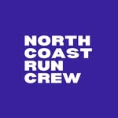

<html lang="en">
<head>
<meta charset="UTF-8" />
<meta name="viewport" content="width=device-width, initial-scale=1.0" />
<title>NCRC — North Coast Run Crew</title>
<meta name="description" content="Your Social Run Crew on the North Coast.
Every Thursday, 7:30pm at Babushka Portrush. 5k, your pace, with a halfway
rest. No sign-ups, no commitments." />

</head>
<body>
<header>
<nav class="nav">
<a href="#" class="logo">

North Coast Run Crew
</a>
<ul class="nav-links">
<li><a href="#about">About</a></li><li><a href="#run">The Run</a></li>
<li><a href="#join">Join</a></li>
<li><a href="#contact">Contact</a></li>
<li><a href="https://www.instagram.com/northcoastruncrew/"
target="_blank" rel="noopener" class="nav-cta">Instagram</a></li>
</ul>
</nav>
</header>

 <section class="hero">

Your Social Run Crew on the North Coast 💙

<h1>Every Thursday.Your pace.</h1>

5k with a halfway rest. No sign-ups. No commitments. Just show up and
run with the crew in Portrush.

<a href="#run" class="btn btn-primary">When & where</a>
<a href="https://www.instagram.com/northcoastruncrew/" target="_blank"
rel="noopener" class="btn btn-ghost">Follow on Instagram</a>

</section>

 <section id="about">

Who we are

<h2 class="section-title">NCRC — North Coast Run Crew</h2>

A friendly social run crew based on Northern Ireland’s North Coast. We
meet every Thursday evening for an easy, inclusive 5k.


 

<h3>All paces welcome</h3>

Whether you’re brand new or a regular, we run at your pace. There’s a
halfway rest so everyone can stick together and enjoy the craic.

<h3>No pressure, no commitment</h3>

No sign-ups. No fees. Just turn up when you can. It’s a local social run
crew — come once or come every week.

<h3>Coastal community</h3>

We meet by the sea in Portrush and keep things simple, welcoming and
social. Blue-heart energy only.

<h3>The vibe</h3>
<ul>
<li>Social first, pace second</li>
<li>Halfway break built in</li>
<li>Locals & visitors welcome</li>
<li>Post-run chat encouraged</li>
<li>Just show up</li>
</ul>

</section>
 <section id="run">

Weekly session

<h2 class="section-title">Thursday evening 5k</h2>

Same time, same place every week. Meet early for a chat, then head out
together.


 

<h3>Thursday social run</h3>

<strong>Meet</strong>
7:30pm at Babushka, Portrush

<strong>Run starts</strong>
7:45pm

<strong>Distance</strong>
5k (with a halfway rest)

<strong>Pace</strong>
Your pace — all abilities welcome

<strong>Where</strong>
Babushka Kitchen Café, South Pier, Portrush

No need to message ahead. Just lace up and come along.
<a href="https://www.instagram.com/northcoastruncrew/"
target="_blank" rel="noopener" class="btn btn-primary">
Check Instagram for updates
</a>

</section>

 <section id="join">

Get involved

<h2 class="section-title">Come run with us</h2>

The easiest way to stay in the loop is Instagram. That’s where we post any
changes and share the crew vibe.

<ul class="join-points">
<li>Free — no membership, no sign-up</li>
<li>Show up on Thursday at 7:30pm</li>
<li>Follow @northcoastruncrew for updates</li>
<li>Bring a friend or come solo</li>
</ul>
<a href="https://www.instagram.com/northcoastruncrew/" target="_blank"
rel="noopener" class="ig-link">
@northcoastruncrew on Instagram →
</a>

</section>

 <section id="contact">

Find us

<h2 class="section-title">Questions or first time?</h2>

Drop us a message on Instagram or just come along — we’ll look after you.


 

IG

<h3>Instagram</h3>
<a href="https://www.instagram.com/northcoastruncrew/"
target="_blank" rel="noopener">@northcoastruncrew</a>

📍

<h3>Meet point</h3>

Babushka South Pier, Portrush

🕐

<h3>Every Thursday</h3>

Meet 7:30pm Run 7:45pm

</section>

 <footer>

Your Social Run Crew on the North Coast 💙

Portrush · Northern Ireland ·
All paces welcome

</footer>
</body>
</html>
